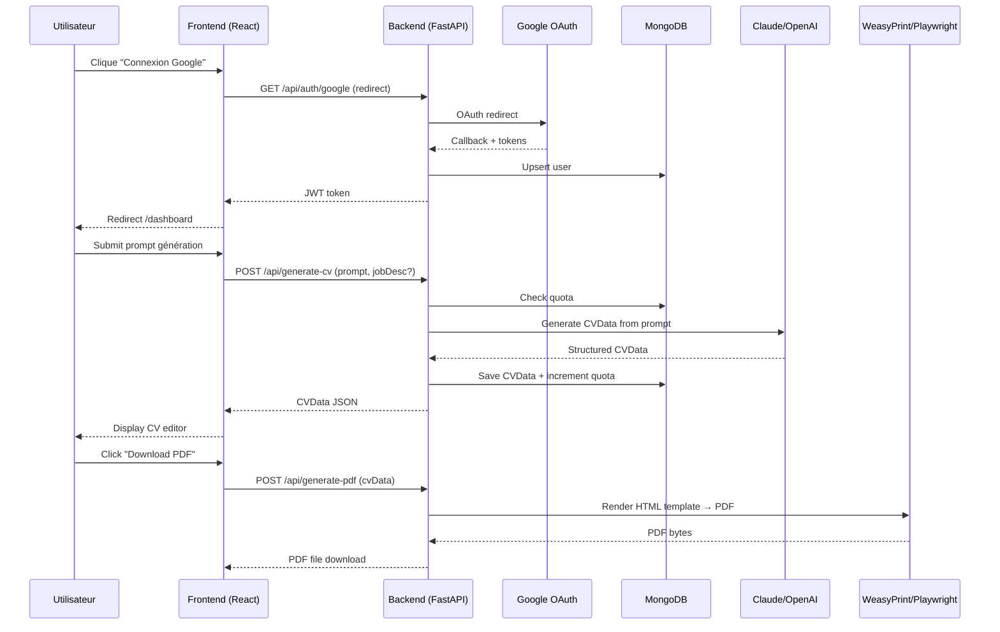

# Stack technique (MVP)

## Frontend
- **React 18** (build Vite ou Create React App)
- **Tailwind CSS** pour UI
- **React Router** pour navigation
- **Axios** pour appels API backend
- Build production → static files servis par Nginx

## Backend
- **Python 3.11+** avec **FastAPI**
- API REST endpoints (`/api/*`)
- Validation données avec **Pydantic**
- Authentification JWT tokens
- CORS configuré pour frontend

## Auth
- **Google OAuth 2.0** via backend Python
- Bibliothèque : `authlib` ou `google-auth`
- Flow : Frontend → Backend `/api/auth/google` → Callback → JWT token
- **JWT tokens** stockés côté client (localStorage/cookies HttpOnly)
- Middleware FastAPI pour protection routes (`@require_auth`)
- Données user : email, name, picture (depuis Google)

### Pourquoi Google OAuth (et pas Magic Link) pour le MVP
| Critère | Google OAuth | Magic Link |
|---------|-------------|------------|
| Friction | 2 clics | Email → clic → retour |
| Conversion | ~90% | ~60-70% |
| Mobile UX | Excellente | Mauvaise (switch app) |
| Implémentation | 3 pts (JWT Python) | 5 pts |
| Coût | Gratuit | Resend (gratuit mais config) |

Magic Link prévu en v2 comme fallback.

## Génération IA
- **Anthropic Claude Sonnet 4** (ou OpenAI GPT-4 fallback)
- Bibliothèque Python : `anthropic` SDK officiel
- Prompt engineering : description libre → CVData structuré (Pydantic model)
- Fallback démo offline si timeout IA (>10s)

## PDF (choix MVP)
### Option 1 (Recommandée MVP) : WeasyPrint
- Template HTML/CSS (Jinja2) → PDF via WeasyPrint
- Pure Python, pas de dépendance Chromium
- Léger, rapide (~2-3s génération)
- Limitations : typographie basique, pas de JS

### Option 2 (Qualité Premium) : Playwright Python
- Template HTML → Playwright Chromium → PDF
- Meilleure qualité rendu (fonts custom, CSS avancé)
- Plus lourd (~200 MB Chromium), plus lent (~5-10s)
- **Recommandé si WeasyPrint insuffisant**

## Asynchronisme (génération en job)
### Option MVP : Génération synchrone
- API endpoint bloquant (`POST /api/generate-cv`)
- Timeout 30s max
- Acceptable si WeasyPrint (<5s) ou génération IA (<10s)

### Option v2 : Worker async (si latence problématique)
- Queue : **Celery** + Redis
- Worker Python séparé consomme tasks
- À la fin : stockage PDF + email notification (Resend)
- Frontend : polling status job

## Base de données
- **MongoDB Atlas M0** (gratuit, 512 MB)
- Driver Python : **Motor** (async) ou **PyMongo** (sync)
- Collections MVP : `users`, `cvs` (historique), `quotas`
- Indexes : `users.email`, `quotas.user_id`, `cvs.user_id`

## Infra & déploiement
- Oracle Linux ARM bare metal
- **Docker Compose**
- **Traefik** (SSL auto)
- **GitHub Actions** build + deploy via SSH

## Email
- **Resend API** pour notifications
- Templates : magic link (v2), CV ready, quota exceeded

## Flux de données (haut niveau)

