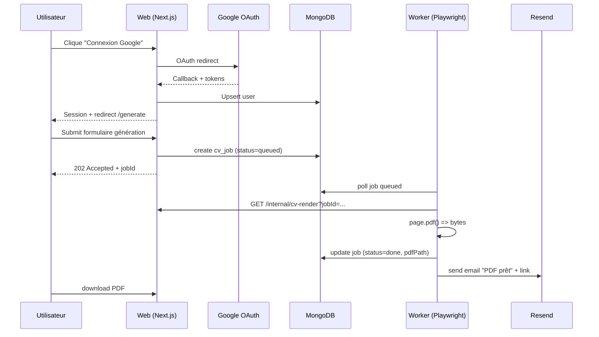

# Stack technique (MVP)

## Frontend/Backend
- **Next.js 14** (App Router)
- API Routes (Route Handlers) pour : auth callbacks, génération, quota, téléchargement
- **Tailwind CSS** pour UI + **print CSS** pour le template CV (HTML)

## Auth
- **NextAuth.js** avec **Google OAuth** (provider unique MVP)
- Session côté serveur (cookies) + protection endpoints (auth obligatoire)
- Données user : email, name, image (depuis Google)

### Pourquoi Google OAuth (et pas Magic Link) pour le MVP
| Critère | Google OAuth | Magic Link |
|---------|-------------|------------|
| Friction | 2 clics | Email → clic → retour |
| Conversion | ~90% | ~60-70% |
| Mobile UX | Excellente | Mauvaise (switch app) |
| Implémentation | 2 pts | 5 pts |
| Coût | Gratuit | Resend (gratuit mais config) |

Magic Link prévu en v2 comme fallback.

## PDF (choix MVP)
### Option retenue : Playwright (Chromium) = rendu pixel-perfect
- Le CV est d'abord rendu en **HTML** (même code de style que le site)
- Un **worker** lance Playwright, charge une route interne (template HTML), puis `page.pdf()`
- Avantages : typographie, gestion sauts de page, cohérence rendu, rapidité d'itération design

## Asynchronisme (génération en job)
- L'API crée un document `cv_jobs` en Mongo
- Un process **worker** (container séparé) consomme les jobs (polling simple en MVP)
- À la fin : stockage PDF + update job + email notification (Resend)

## Base de données
- **MongoDB Atlas M0**
- Stockage minimal (MVP) : user + quota + jobs + (optionnel) waitlist

## Infra & déploiement
- Oracle Linux ARM bare metal
- **Docker Compose**
- **Traefik** (SSL auto)
- **GitHub Actions** build + deploy via SSH

## Flux de données (haut niveau)

