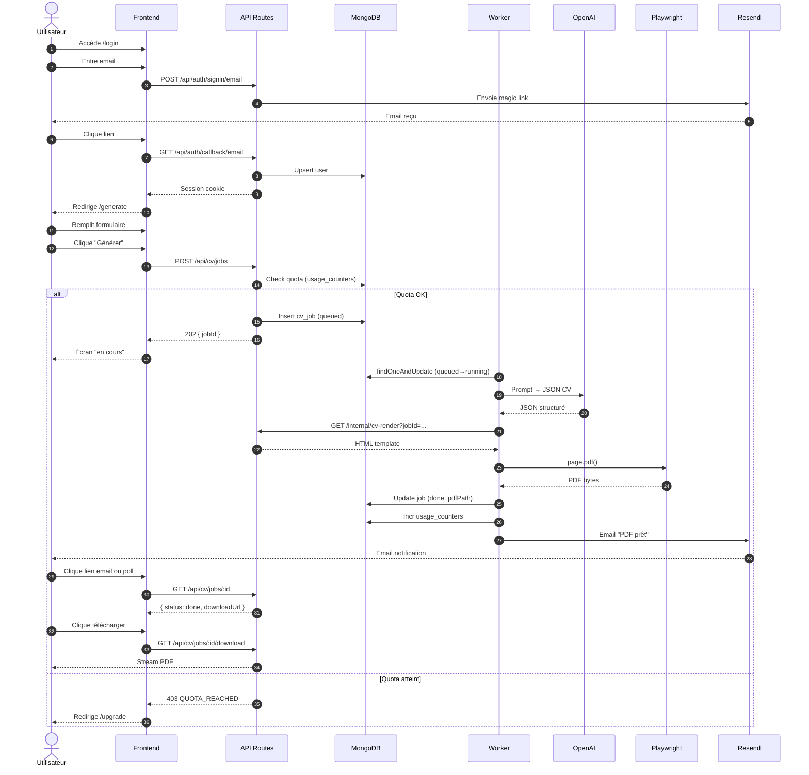
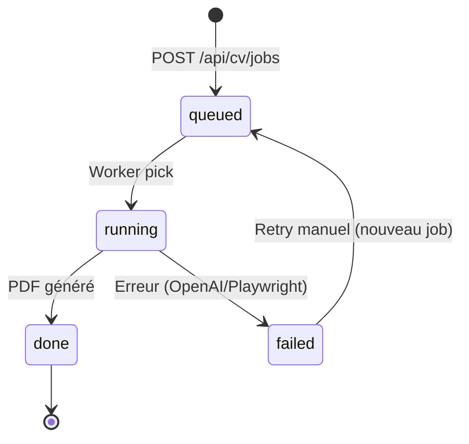
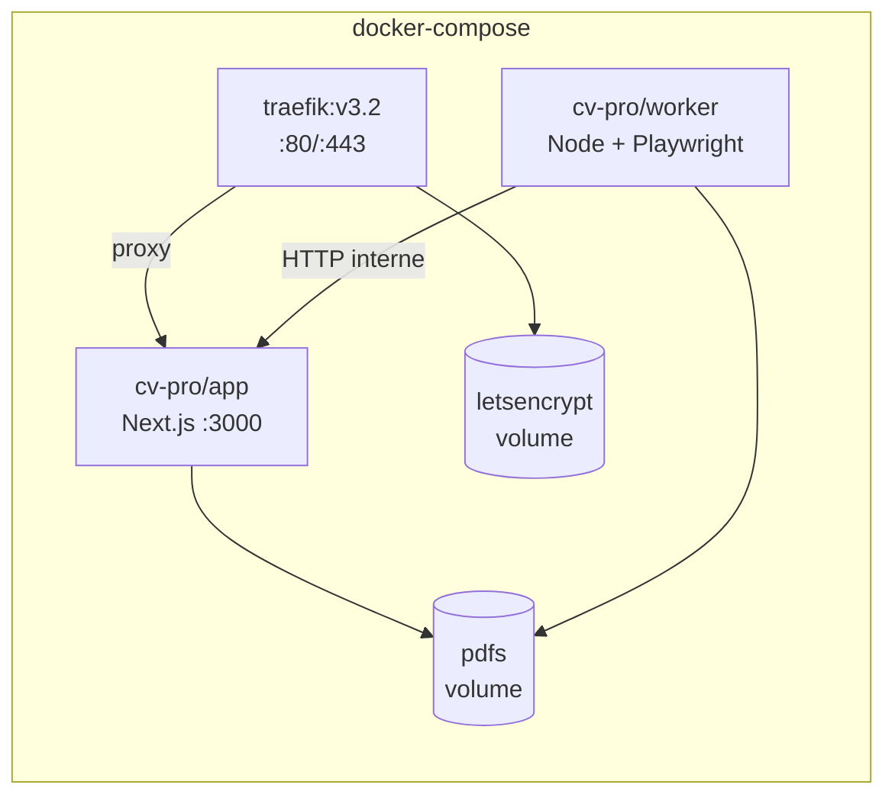
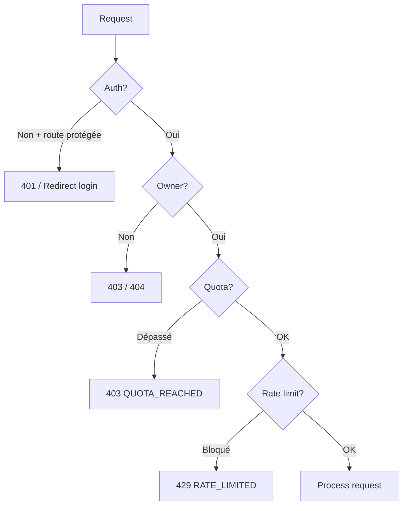

# Diagramme système — CV Instant Pro

## Architecture globale

```mermaid
flowchart TB
    subgraph Internet
        U[Utilisateur]
    end

    subgraph Infra["Oracle Linux ARM (Docker)"]
        T[Traefik<br/>SSL + Routing]
        
        subgraph App["Next.js App"]
            FE[Pages React<br/>Tailwind]
            API[API Routes]
            RENDER[/internal/cv-render]
        end
        
        W[Worker<br/>Playwright + Chromium]
        PDF[(Volume PDFs)]
    end
    
    subgraph External
        MONGO[(MongoDB Atlas)]
        RESEND[Resend API]
        OPENAI[OpenAI API]
    end

    U -->|HTTPS| T
    T --> FE
    T --> API
    
    API <-->|Session/Users/Jobs| MONGO
    API -->|Magic Link| RESEND
    
    W -->|Poll jobs| MONGO
    W -->|Generate text| OPENAI
    W -->|GET HTML| RENDER
    W -->|Write| PDF
    W -->|Job done email| RESEND
    
    API -->|Stream| PDF
```

---

## Flux utilisateur complet



---

## États du job



---

## Composants Docker



---

## Sécurité résumée



